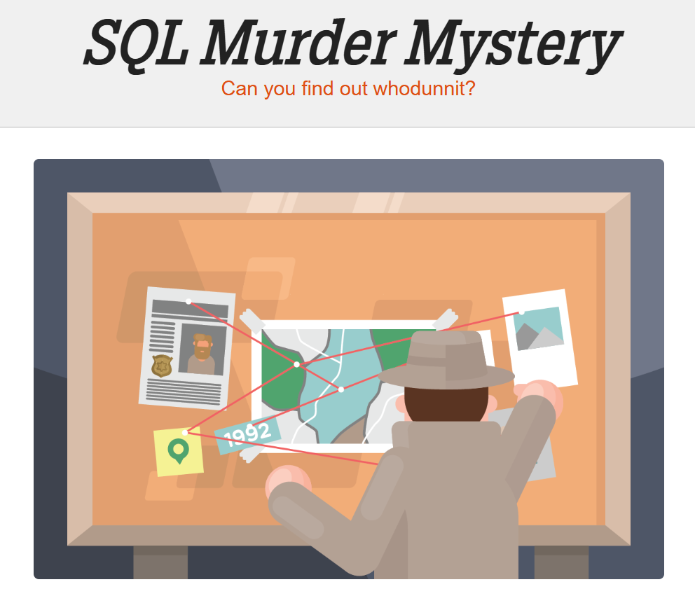

# 🕵️ SQL Murder Mystery – Data Investigation Case Study

## 📌 Overview
This project presents a complete analytical solution to the **SQL Murder Mystery** challenge — a hands-on case study that simulates a real-world investigative scenario using SQL.

The goal of this project was to solve a fictional murder case by querying structured relational data, uncovering:
- The **killer**
- The **mastermind behind the crime**

This repository demonstrates how SQL can be leveraged not just for data retrieval, but for logical reasoning, pattern detection, and investigative analysis.

---

## 🧩 Problem Description
A murder has taken place in **SQL City** on **January 15, 2018**.

Using the available database tables (crime reports, people, interviews, gym records, licenses, and event check-ins), the task is to:
1. Analyze the crime scene
2. Identify witnesses
3. Extract clues from interviews
4. Narrow down suspects
5. Identify the killer
6. Uncover the mastermind behind the crime

---

## 🗂️ Dataset / Context
The dataset consists of multiple relational tables representing different aspects of the investigation:

- `crime_scene_report` → Details of reported crimes  
- `person` → Information about individuals  
- `interview` → Witness and suspect statements  
- `get_fit_now_member` → Gym membership details  
- `get_fit_now_check_in` → Gym attendance logs  
- `drivers_license` → Personal attributes and vehicle info  
- `facebook_event_checkin` → Event attendance records  

These tables are interconnected and require multi-step querying and joins to extract meaningful insights.

---

## 🔍 Step-by-Step Approach

### 1. Identify the Crime
- Filtered the `crime_scene_report` table for the murder in SQL City on the given date.

### 2. Locate Witnesses
- Based on the report:
  - Witness 1: Last house on **Northwestern Dr**
  - Witness 2: **Annabel** from **Franklin Ave**

### 3. Retrieve Witness Details
- Identified:
  - **Morty Schapiro**
  - **Annabel Miller**

### 4. Analyze Witness Interviews
- Extracted key clues:
  - Killer had a **"Get Fit Now" gym bag**
  - Membership ID started with **48Z**
  - **Gold membership**
  - Visited gym on **Jan 9, 2018**
  - Car plate contained **H42W**

### 5. Identify the Killer
- Joined:
  - Gym membership data
  - Check-in logs
  - Person details
  - Driver's license records  
- Applied all filters from clues

✅ **Killer Identified:**  
**Jeremy Bowers (ID: 67318)**

---

### 6. Investigate Further (Mastermind)
- Analyzed the killer's interview
- Extracted new clues about the mastermind:
  - Female
  - Wealthy
  - Height: **65–67 inches**
  - **Red hair**
  - Drives **Tesla Model S**
  - Attended **SQL Symphony Concert 3 times in Dec 2017**

### 7. Identify the Mastermind
- Queried `facebook_event_checkin` to find frequent attendees
- Combined with driver and personal data

🎯 **Mastermind Identified:**  
**Miranda Priestly (ID: 99716)**

---

## 🧠 Key Findings

| Role        | Name               | ID     |
|------------|--------------------|--------|
| 🔫 Killer   | Jeremy Bowers      | 67318  |
| 🧠 Mastermind | Miranda Priestly   | 99716  |

---

## 📁 Project Structure
```
sql-murder-mystery/
├── README.md               # Project overview and documentation
├── sql/
│   └── solution.sql        # Step-by-step SQL solution queries
├── docs/
│   └── approach.md         # Detailed investigation walkthrough
└── assets/                 # ERD diagrams, screenshots, and visuals
```


| Path | Purpose |
|------|---------|
| `README.md` | Project overview, findings, and instructions |
| `sql/solution.sql` | Complete step-by-step SQL queries for the investigation |
| `docs/approach.md` | Detailed explanation of the investigative reasoning |
| `assets/` | Entity-relationship diagrams, query screenshots, and other visuals |

---

## 🕵️‍♂️ How Can You Solve This Murder?

Want to try solving the case yourself?

1. Visit the official **SQL Murder Mystery** challenge page:  
   https://mystery.knightlab.com/

2. Carefully read the problem statement provided there — it sets up the entire investigation.

3. You’ll find an **interactive SQL editor (code box)** on the page.

4. Write and execute SQL queries directly in that editor to:
   - Explore the database  
   - Follow clues  
   - Identify suspects  

5. Continue querying step-by-step until you uncover:
   - The **killer**
   - The **mastermind behind the crime**

Think of it as a live investigation — your SQL queries are your tools, and the database is your evidence.

---

## 🛠️ SQL Skills

- JOIN
- GROUP BY
- HAVING
- WITH & Common Table Expressions
- LIKE Operator
- ORDER BY

---

## 👨‍💻 Author

**Devashish**  
Data Engineer | Generative AI Enthusiast  

- Passionate about solving problems using data  
- Experienced in SQL, Databricks, and data pipelines  
- Exploring advanced analytics and AI-driven systems  

---

## 📚 References

- [SQL Murder Mystery Official Challenge](https://mystery.knightlab.com/)
- Knight Lab (Northwestern University)

---

## 🚀 Final Thoughts

This project highlights how structured querying combined with logical reasoning can solve complex problems.

It's not just about writing SQL — it's about **thinking like an investigator with data as your evidence**.


